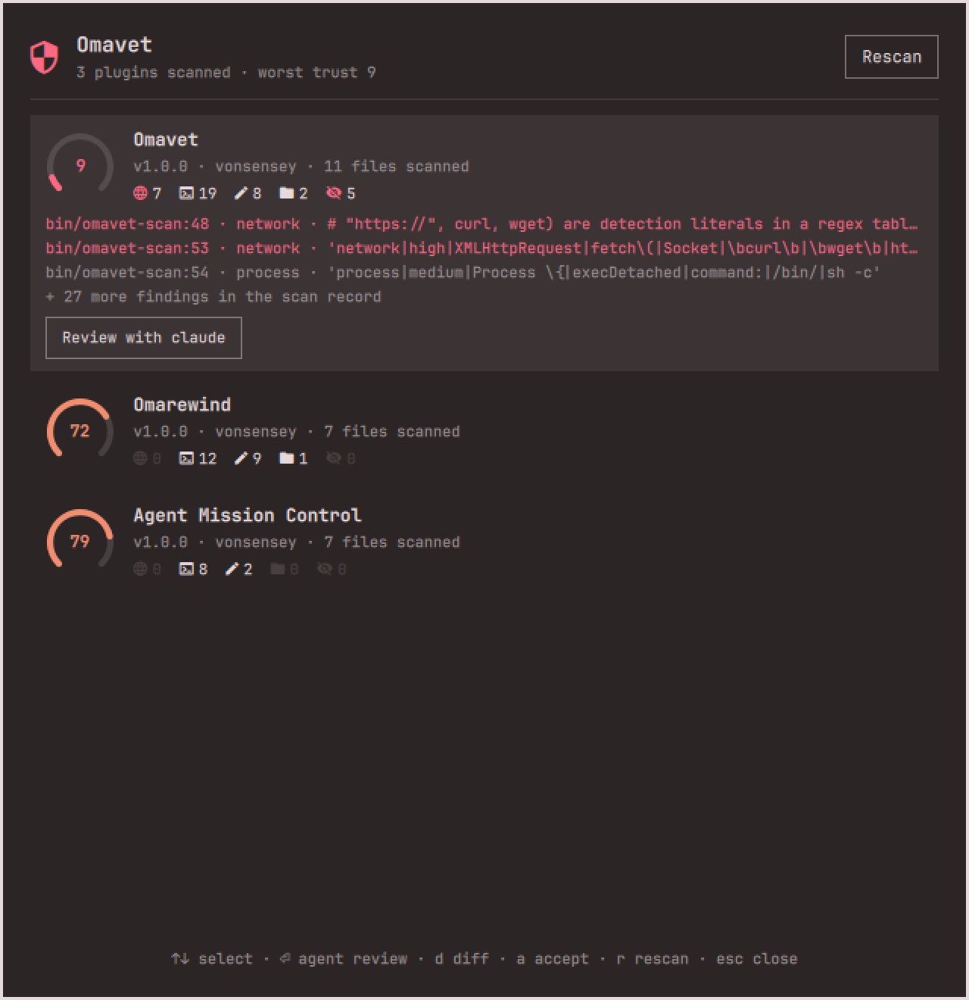

# Omavet

**Local security review for your Omarchy plugins.** Every plugin you install
runs unsandboxed inside your shell process. Omavet is the immune system for
that malleable surface: it inventories everything under
`~/.config/omarchy/plugins/`, runs a deterministic capability scan over each
plugin's QML/JS/shell sources, and shows you what each one *can do* — before
you have to trust it blindly.



- **Bar widget** — a shield tinted by the worst trust score across all
  installed plugins (calm → accent → urgent, all theme tokens), with a badge
  dot when any plugin has a git update you haven't reviewed yet.
- **Report panel** — one card per plugin: a speedometer-style trust dial,
  capability counts (network / process spawn / file writes / filesystem
  reach / obfuscation), the top findings with file:line, and actions.
- **Review gate for updates** — when a plugin's git checkout moves past the
  state you last accepted, Omavet flags it. `View diff` shows exactly what
  changed; `Accept update` sets the new baseline.
- **Agent review on demand** — the `Review with agent` button pipes the
  plugin's code to *your own* `claude` or `codex` CLI in a floating terminal.
  If neither is installed, Omavet says so and keeps working; the deterministic
  scan never needs an agent.

## No verdicts, by design

Omavet **never says "safe"**. It reports findings and capabilities from an
honest grep-class scan, and turns them into a deterministic trust score
(more capability signals → lower score; the formula is documented in
`bin/omavet-scan`). A low score means "read this one before trusting it",
not "malware". A perfect 100 means "no capability signals found", not "audited".

True to that: **Omavet flags itself.** Its own scanner contains the very
patterns it greps for, it spawns processes, and it reads other plugins' code —
so its own report card is honestly mediocre. The vet does not exempt itself.

## Install

```
omarchy plugin add https://github.com/vonsensey/omavet --enable --yes
```

The shield appears on your bar automatically. To reposition it, or to tune
the rescan interval:

```
omarchy bar move io.github.vonsensey.omavet --section right
omarchy bar set io.github.vonsensey.omavet refreshIntervalSec 7200
```

(`omarchy bar put` also places the widget if you ever remove it from the bar.)

Summon the panel directly with:

```
omarchy-shell shell toggle io.github.vonsensey.omavet
```

## Remove

```
omarchy plugin remove io.github.vonsensey.omavet
```

Scan records live under `~/.local/state/omarchy/omavet/` and can be deleted
freely at any time.

## What it writes, and what it does not

- **Writes only** under `~/.local/state/omarchy/omavet/`: one JSON scan
  record per installed plugin, plus per-plugin reviewed-commit markers.
- **Reads plugin code read-only.** It never modifies, executes, or loads the
  plugins it scans.
- **Makes NO network calls of its own.** Ever. The scan is pure local
  bash + jq + grep + git.
- **Only invokes your own agent CLI** (`claude` or `codex`) when you
  explicitly press "Review with agent" — and tells you plainly when neither
  is installed instead of failing.
- Zero dependencies beyond what Omarchy ships (bash, jq, grep, git,
  coreutils).

## Usage

| Where | Action | Effect |
|---|---|---|
| Bar shield | left-click | toggle the report panel |
| Bar shield | middle-click | rescan now |
| Panel | `↑`/`↓` or `j`/`k` | move selection |
| Panel | `Enter` | review selected plugin with your agent CLI |
| Panel | `d` | show git diff of unreviewed changes |
| Panel | `a` | accept a pending update (new review baseline) |
| Panel | `r` | rescan all plugins |
| Panel | `Esc` | close |

The rescan interval is configurable per-widget (default 3600s, range
300–86400) via the bar widget's settings.

CLI, for scripting or cron:

```
~/.config/omarchy/plugins/io.github.vonsensey.omavet/bin/omavet-scan            # scan all
~/.config/omarchy/plugins/io.github.vonsensey.omavet/bin/omavet-scan --diff ID  # unreviewed diff
~/.config/omarchy/plugins/io.github.vonsensey.omavet/bin/omavet-scan --accept ID
~/.config/omarchy/plugins/io.github.vonsensey.omavet/bin/omavet-review ID       # agent review
```

## Suggested keybind

Add to `~/.config/hypr/bindings.lua`:

```lua
o.bind("SUPER + CTRL + G", "Omavet plugin review", "omarchy-shell shell toggle io.github.vonsensey.omavet")
```

`SUPER + CTRL + G` is unbound in stock Omarchy; pick any free chord you like.

## Footprint

The heavy lifting is a short-lived bash process on an hourly timer; the QML
side only watches the JSON records it writes.

Measured on the author's machine (Omarchy 4.0.0, `omarchy-shell`):

- **Always resident:** a headless QML service (one refresh timer) inside the
  shared `omarchy-shell` process. Its incremental RSS is a few hundred KB and
  is not separably measurable against the shell's own ~300 MB — enabling the
  plugin produced no observable steady-state RSS change.
- **Per scan (transient):** `omavet-scan` is a `bash + jq + grep` pass that
  runs on the timer and exits. Peak ≈ **15 MB**, wall-clock ≈ **0.64 s** to
  scan every installed plugin's sources (3 plugins here; grows with your
  plugin count, still hourly by default).

No daemon, no persistent network socket, nothing kept warm between scans.

## Tests

```
bash test/check.sh
```

Plain bash asserts over fixture plugins (one benign, one with obvious
network + eval findings), plus empty/missing plugin dirs, weird filenames,
stale-record pruning, hostile manifest ids (path traversal, leading dashes,
NUL-byte evasion, record-name collisions), and the full git
baseline → dirty → accept flow.

## License

MIT © 2026 vonsensey
